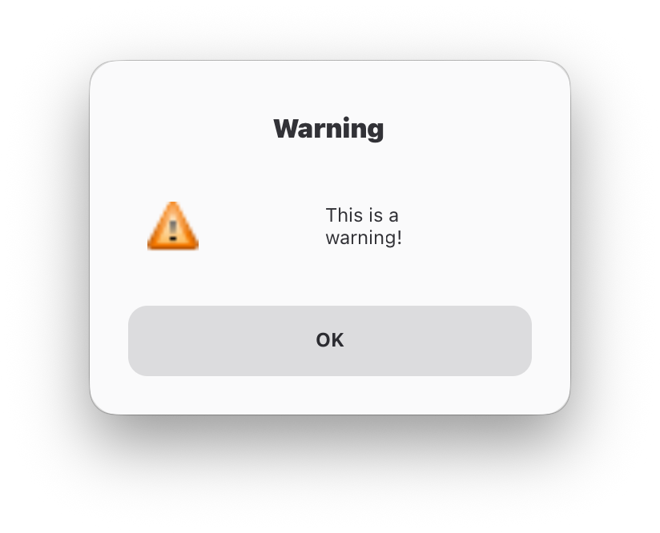
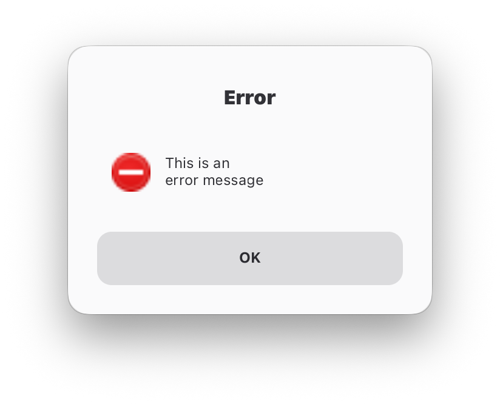
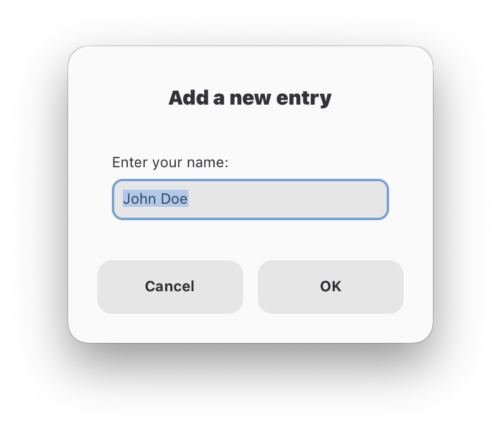
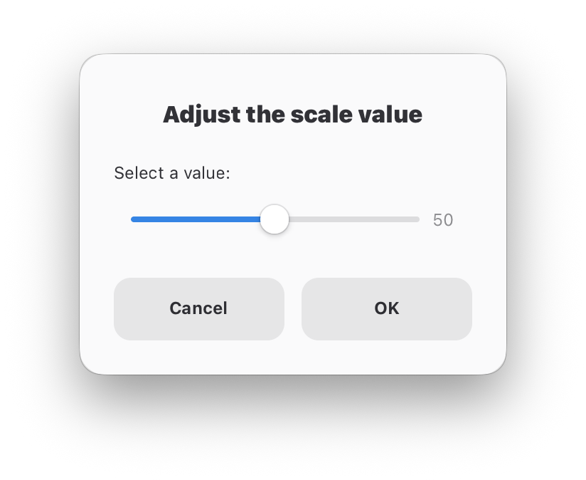
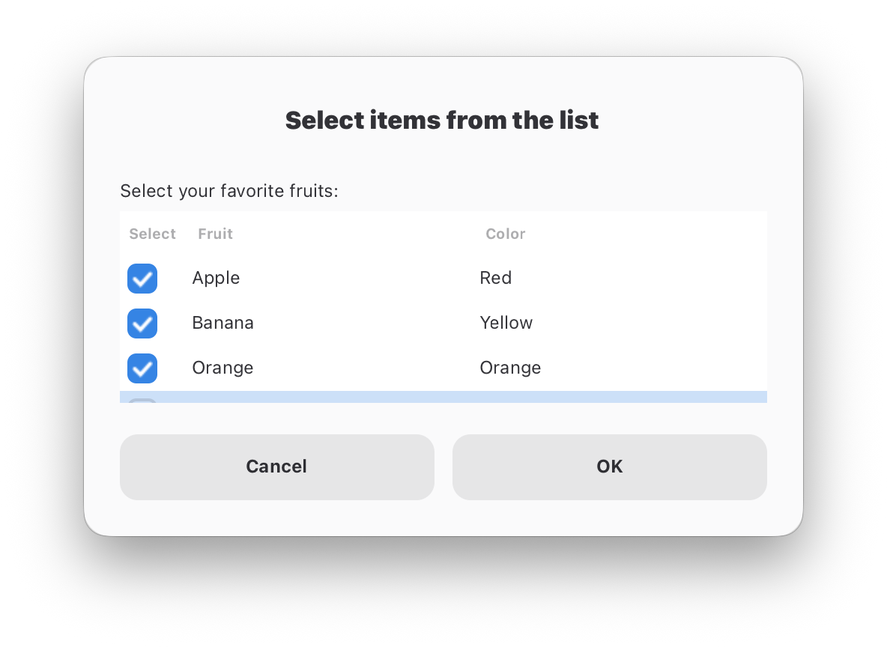
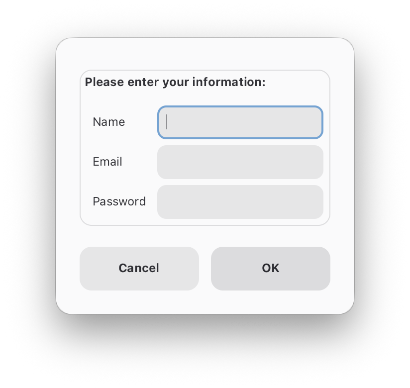
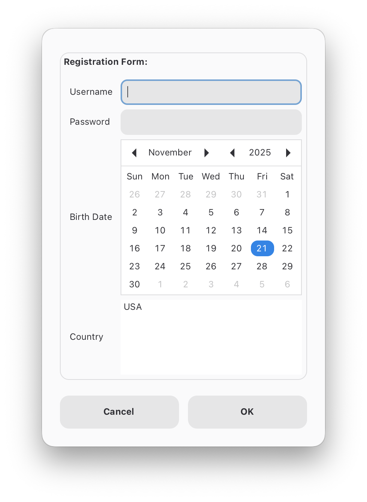
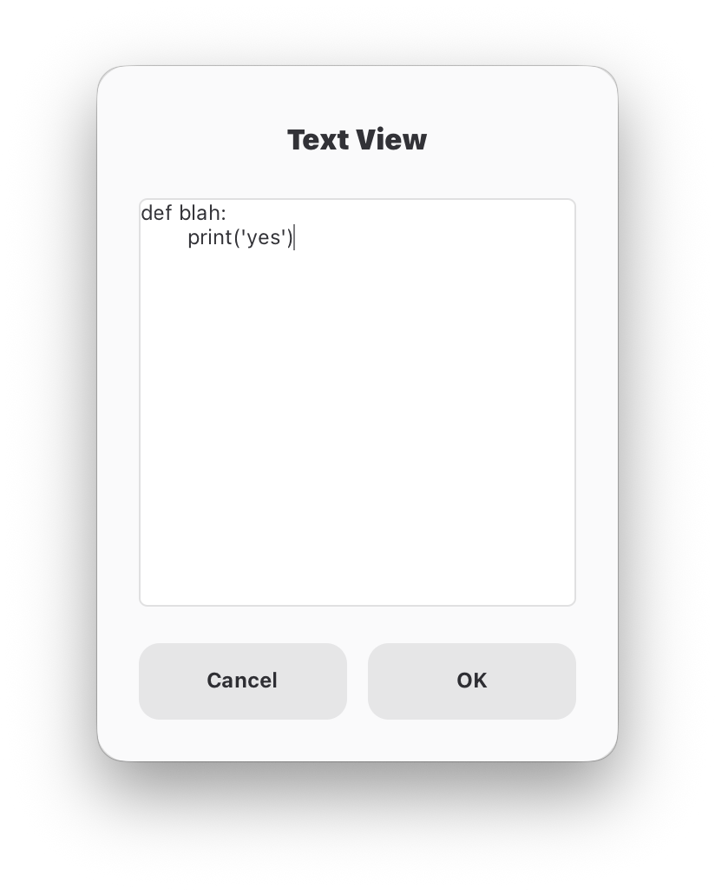

# Bun Zenity Wrapper

A fully-typed TypeScript wrapper for Zenity dialogs, providing an easy-to-use API for creating native desktop dialogs in your Bun applications.

## Prerequisites

Install Zenity on your system:

```bash
# macOS
brew install zenity

# Ubuntu/Debian
sudo apt-get install zenity

# Fedora
sudo dnf install zenity
```

> **macOS Note:** This wrapper automatically configures Zenity to prevent GTK4-related crashes on macOS by setting the `GSETTINGS_BACKEND=memory` environment variable. No additional setup required!

## Installation

Install from npm once published:

```bash
# With Bun
bun add zenity-wrapper

# With npm
npm install zenity-wrapper

# With pnpm
pnpm add zenity-wrapper
```

## Usage

```typescript
import Zenity from 'zenity-wrapper';

const zenity = new Zenity();

// Show an info dialog
await zenity.info("Hello, World!", { title: "Greeting" });

// Ask a question
const confirm = await zenity.question("Continue?");
if (confirm) {
  console.log("User confirmed!");
}

// Get user input
const name = await zenity.entry("Enter your name:");
console.log(`Hello, ${name}!`);

// Forms with button differentiation (NEW!)
const result = await zenity.forms(
  [
    { type: 'entry', label: 'Name' },
    { type: 'entry', label: 'Email' }
  ],
  {
    title: 'Contact Info',
    extraButton: 'Skip'  // Optional third button
  }
);

// Now you can distinguish which button was clicked
if (result.button === 'ok') {
  console.log('Submitted:', result.values);
} else if (result.button === 'extra') {
  console.log('User clicked Skip button');
} else {
  console.log('User cancelled');
}
```

### Breaking Change in Forms API

**⚠️ Important:** The `forms()` method now returns a `FormsResult` object instead of `string[] | null`.

**Before:**
```typescript
const values = await zenity.forms([...], options);
if (values) {
  console.log(values);
}
```

**After:**
```typescript
const result = await zenity.forms([...], options);
if (result.button === 'ok' && result.values) {
  console.log(result.values);
}
```

This change allows you to distinguish between Cancel and Extra button clicks, which was previously impossible.

## Demos

The `demos` directory contains TypeScript ports of the Python Zenity Wrapper demos. You can run any demo using `bun`:

```bash
bun demos/info_dialog.ts
bun demos/simple_form.ts
```

### Available Demos

#### Message Dialogs
- `info_dialog.ts` - Information message
- `warning_dialog.ts` - Warning message
- `error_dialog.ts` - Error message
- `question_dialog.ts` - Yes/No question

#### Input Dialogs
- `entry_dialog.ts` - Text input
- `password_dialog.ts` - Password input
- `scale_dialog.ts` - Slider/Scale
- `calendar_dialog.ts` - Date picker

#### Selection Dialogs
- `list_dialog.ts` - Simple list selection
- `checklist_dialog.ts` - Multiple selection checklist
- `radiolist_dialog.ts` - Single selection radio list
- `file_selection_dialog.ts` - File/Directory picker

#### Progress Dialogs
- `progress_dialog.ts` - Progress bars

#### Text Dialogs
- `text_dialog.ts` - Text viewer/editor

#### Form Dialogs
- `simple_form.ts` - Basic form with entry fields
- `password_form.ts` - Login/Registration form
- `multiline_form.ts` - Form with multiline text area
- `calendar_form.ts` - Form with date picker
- `combo_form.ts` - Form with dropdowns
- `list_form.ts` - Form with list selection
- `comprehensive_form.ts` - Form showcasing all field types


## Screenshots

### Message Dialogs

<table>
<tr>
<td align="center">
<br>
<b>Info Dialog</b>
</td>
<td align="center">
<br>
<b>Warning Dialog</b>
</td>
</tr>
<tr>
<td align="center">
<br>
<b>Error Dialog</b>
</td>
<td align="center">
<br>
<b>Question Dialog</b>
</td>
</tr>
</table>

### Input Dialogs

<table>
<tr>
<td align="center">
<br>
<b>Text Entry</b>
</td>
<td align="center">
<br>
<b>Password Entry</b>
</td>
</tr>
<tr>
<td align="center">
<br>
<b>Scale/Slider</b>
</td>
<td align="center">
<br>
<b>Calendar</b>
</td>
</tr>
</table>

### Selection Dialogs

<table>
<tr>
<td align="center">
<br>
<b>Single Selection List</b>
</td>
<td align="center">
<br>
<b>Multiple Selection List</b>
</td>
</tr>
</table>

### Form Dialogs

<table>
<tr>
<td align="center">
<br>
<b>User Info Form</b>
</td>
<td align="center">
<br>
<b>Registration Form</b>
</td>
</tr>
<tr>
<td align="center">
<br>
<b>Login Form</b>
</td>
<td align="center">
<br>
<b>Text Editor</b>
</td>
</tr>
<tr>
<td align="center">
<br>
<b>Form with Multiline Entry</b>
</td>
<td align="center">
</td>
</tr>
</table>

### Controlling Multiline Input Height

When using forms with multiline text fields, you can control the height by setting the `height` option on the dialog. Zenity automatically distributes the available space among form fields, with multiline fields receiving proportionally more vertical space.

**How it works:**

- Single-line fields (entry, password, combo) have a fixed height
- Multiline fields expand to use the remaining available vertical space
- The `height` parameter controls the overall dialog height, not individual fields

**Example:**

```typescript
const zenity = new Zenity();

// Small multiline area (default height)
const result1 = await zenity.forms(
  [
    { type: 'entry', label: 'Title' },
    { type: 'multiline', label: 'Description' },
    { type: 'entry', label: 'Tags' }
  ],
  {
    text: "Create a Post",
    separator: "||"
  }
);

// Large multiline area (increased height)
const result2 = await zenity.forms(
  [
    { type: 'entry', label: 'Title' },
    { type: 'multiline', label: 'Description' },
    { type: 'entry', label: 'Tags' }
  ],
  {
    text: "Create a Post",
    separator: "||",
    width: 600,
    height: 800  // More dialog height = more space for multiline field
  }
);
```

**Note:** Zenity doesn't provide command-line options to control individual field heights. The layout is handled automatically based on the overall dialog dimensions.

## API Documentation

See [ZENITY_API.md](./ZENITY_API.md) for complete API documentation with examples for all dialog types.

## Forms Collection

The `FormCollection` class (`forms_collection.ts`) provides pre-built, developer-focused forms for common workflows. These forms combine multiple input types to collect structured data for various tasks.

### Running the Forms Collection Demo

```bash
bun run forms_collection.ts
```

### Available Forms

The collection includes 24+ ready-to-use forms organized by category:

#### Project Setup

- Package Initialization (npm/Bun packages)
- TypeScript Configuration
- Python Project Setup
- Web Project Setup (React, Vue, etc.)

#### Git & Version Control

- Conventional Git Commits
- Pull Requests
- Release Versioning
- .gitignore Generator

#### Configuration Files

- Environment Variables
- ESLint/Prettier Config
- VS Code Workspace Settings
- Package.json Scripts

#### Deployment & DevOps

- Docker Container Config
- GitHub Actions Workflows
- SSH Configuration

#### Database & Services

- Database Connection Setup
- API Configuration

#### Documentation

- README Generator
- Changelog Entries
- Blog Post Metadata

#### Issue Tracking

- Bug Reports
- Feature Requests

### Usage Example

```typescript
import { FormCollection } from './forms_collection';

const forms = new FormCollection();

// Collect package initialization data
const pkgData = await forms.packageInit();
console.log(pkgData);
// {
//   packageName: 'my-app',
//   version: '0.1.0',
//   description: 'My awesome app',
//   author: 'Developer Name',
//   license: 'MIT',
//   runtime: 'Bun'
// }

// Collect git commit data
const commit = await forms.gitCommit();
console.log(commit);
// {
//   type: 'feat',
//   scope: 'api',
//   summary: 'Add user authentication',
//   description: 'Implemented JWT-based auth',
//   breaking: 'No'
// }
```

All forms return structured objects with named fields, making it easy to integrate into scripts and automation workflows.

## Running the Demo

```bash
bun run demo.ts
```

The demo showcases all available dialog types including:

- Message dialogs (info, warning, error, question)
- Input dialogs (entry, password, scale, calendar)
- Selection dialogs (list, color picker)
- File dialogs (open, save, directory)
- Progress dialogs
- Advanced dialogs (forms, text editor)

## Building

You can build your TypeScript files with Bun:

```bash
# Build a single file
bun build ./demo.ts --outdir ./dist

# Build with minification
bun build ./demo.ts --outdir ./dist --minify

# Build as a standalone executable
bun build ./demo.ts --compile --outfile zenity-demo
```

For more build options, see the [Bun build documentation](https://bun.sh/docs/bundler).

## TypeScript Support

This library is written in TypeScript and includes full type definitions. All dialog options are properly typed for an excellent development experience.

```typescript
import Zenity, { QuestionOptions, ListOptions } from './zenity-wrapper';

const options: QuestionOptions = {
  title: "Confirm",
  okLabel: "Yes",
  cancelLabel: "No"
};
```

## Project Info

This project was created using `bun init` in bun v1.3.2. [Bun](https://bun.com) is a fast all-in-one JavaScript runtime.

## Publishing

To publish the package to npm:

```bash
# Build the package
bun run build

# Login to npm if needed
npm login

# Publish
npm publish --access public

# Alternatively, using Bun
bun publish
```

If the name `zenity-wrapper` is taken on npm, update the `name` field in `package.json` before publishing.
